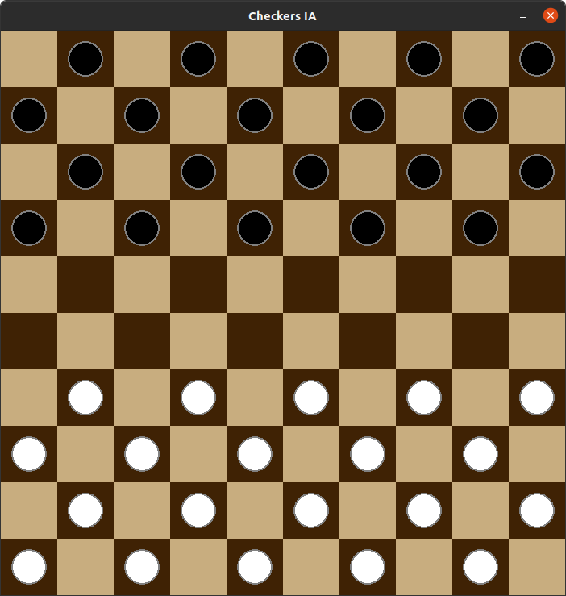

# AI Checkers
Project realized in the context of the 6th semester of the third year degree in computer science at Université Paris Cité (Descartes) 

## Action plan
- Implement a human vs human checkers game following the international rules.
- Implement a minimax algorithm 
- Replace human player by the AI
- Implement alpha beta pruning 
- Implement different heuristics
- Implement different levels of difficulty

## Technologies Used
Python and Pygame 
## Screenshots

## Usage

`python3 ./launch.py`

